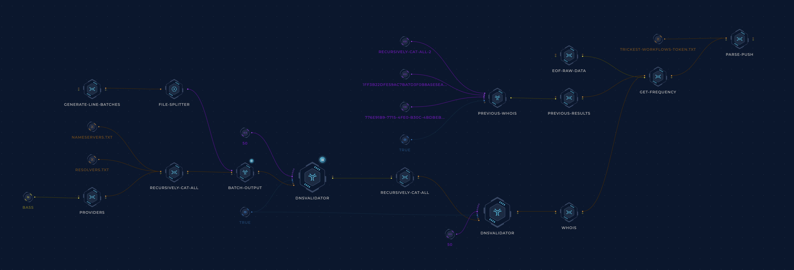

<h1 align="center">Resolvers </h1>
<h3 align="center">The most exhaustive list of reliable DNS resolvers</h3>

- [resolvers.txt](resolvers.txt): A simple list of resolver IP addresses, which you can pass directly to your DNS enumeration tool.

- [resolvers-extended.txt](resolvers-extended.txt): All of the resolvers in `resolvers.txt` with additional information about each server, including the organization it belongs to, its country, and how many times it has been detected as valid. If a resolver is valid enough times, it may earn its place in the next file.

- [resolvers-trusted.txt](resolvers-trusted.txt): A list of trusted resolvers from organizations like Cloudflare, Google, etc. We recommend you use this list to re-validate the results you get with the main resolvers.

## How it Works
A [Trickest](https://trickest.com) workflow creates an initial dataset of resolvers from various sources and then uses multiple instances of [dnsvalidator](https://github.com/vortexau/dnsvalidator) to validate and re-validate this dataset and make it as reliable as possible.

### TB; DZ (Too big; didn't zoom)
- We collect the initial dataset from three sources:
  - [The Public DNS Server List](https://public-dns.info/nameservers.txt)
  - A list of provider DNS servers collected from [bass](https://github.com/Abss0x7tbh/bass/tree/master/resolvers) (Thanks, [Abss0x7tbh](https://github.com/Abss0x7tbh)).
  - A community-maintained list of resolvers on [janmasarik/resolvers](https://github.com/janmasarik/resolvers) (Thanks, [janmasarik](https://github.com/janmasarik)).
- This mega list of resolvers is then `sort -u`d and split up into smaller chunks.
- Multiple instances of [dnsvalidator](https://github.com/vortexau/dnsvalidator) are created to validate the resolver lists in parallel (Huge thanks to [vortexau](https://github.com/vortexau) and [codingo](https://github.com/codingo)).
- Then we run another round of [dnsvalidator](https://github.com/vortexau/dnsvalidator) to weed out any false positives that survived the previous step.
- The final resolvers list is passed to a `whois` script (which uses [APNIC](https://www.apnic.net/)'s API) to find out the organization and country to which each resolver belong.
- In the end, the workflow counts the number of times it found each resolver to be valid throughout all the previous runs and writes the frequency data to `resolvers-extended.txt`.
- This workflow is scheduled to run constantly.

## Contribution
All contributions/ideas/suggestions are welcome! Feel free to create a new ticket via [GitHub issues](https://github.com/trickest/resolvers/issues), tweet at us [@trick3st](https://twitter.com/trick3st), or join the conversation on [Discord](https://discord.gg/7HZmFYTGcQ).

## Build your own workflows!
We believe in the value of tinkering. Sign up for a demo on [trickest.com](https://trickest.com) to customize this workflow to your use case, get access to many more workflows, or build your own from scratch!
